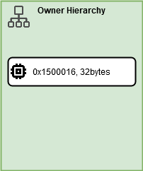
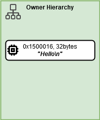
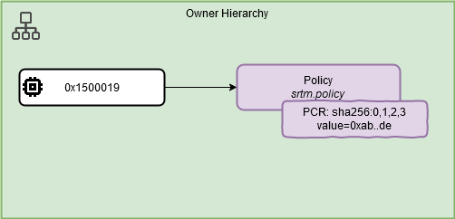

# Using NVRAM
- [Using NVRAM](#using-nvram)
  - [Handles](#handles)
  - [Listing NVRAM Areas](#listing-nvram-areas)
  - [Basics: Defining, Reading and Writing](#basics-defining-reading-and-writing)
    - [Defintion](#defintion)
    - [Writing](#writing)
    - [Reading](#reading)
    - [Writing and Reading Again](#writing-and-reading-again)
    - [Removing an NVRAM area](#removing-an-nvram-area)
  - [Counters](#counters)
    - [Defintion](#defintion-1)
  - [Read and Write Locking](#read-and-write-locking)
    - [Write locking](#write-locking)
    - [Read locking](#read-locking)
  - [Sealing](#sealing)
    - [Policy Creation](#policy-creation)
    - [Defining an NVRAM area with Policies](#defining-an-nvram-area-with-policies)
    - [Writing and Reading](#writing-and-reading)
    - [Changes to the PCRs](#changes-to-the-pcrs)
    - [Removal of the Policy Protected Area](#removal-of-the-policy-protected-area)

The TPM contains some general purpose memory which can be used to store whatever you wish.
Each defined area can also be protected - there are a number of mechanisms for this, and the process is called *sealing*.
The most common way to seal NVRAM is to seal it against a particular combination of PCRs.

- [Using NVRAM](#using-nvram)
  - [Handles](#handles)
  - [Listing NVRAM Areas](#listing-nvram-areas)
  - [Basics: Defining, Reading and Writing](#basics-defining-reading-and-writing)
    - [Defintion](#defintion)
    - [Writing](#writing)
    - [Reading](#reading)
    - [Writing and Reading Again](#writing-and-reading-again)
    - [Removing an NVRAM area](#removing-an-nvram-area)
  - [Counters](#counters)
    - [Defintion](#defintion-1)
  - [Read and Write Locking](#read-and-write-locking)
    - [Write locking](#write-locking)
    - [Read locking](#read-locking)
  - [Sealing](#sealing)
    - [Policy Creation](#policy-creation)
    - [Defining an NVRAM area with Policies](#defining-an-nvram-area-with-policies)
    - [Writing and Reading](#writing-and-reading)
    - [Changes to the PCRs](#changes-to-the-pcrs)
    - [Removal of the Policy Protected Area](#removal-of-the-policy-protected-area)


## Handles
Each area of NVRAM is addressed by a handle. Typically NVRAM area handles are in the `0x1xxxxxxx` range. 
Other values may occur for specific reasons, but to remain true to the standard for TPMs, use this range. 

## Listing NVRAM Areas
The first command lists all the defined NVRAM areas and the properties of those areas:

```bash
tpm2_nvreadpublic
```

This will print out a list, which even on a brand new TPM will probably contain items, for example, an entry looks like this.

```bash
0x1c0000a:
  hash algorithm:
    friendly: sha256
    value: 0xB
  attributes:
    friendly: ppwrite|writedefine|ppread|ownerread|authread|no_da|written|platformcreate
    value: 0x1200762
  size: 775
```

The first item `0x1c0000a` is the handle to the NVRAM area.
The next two attributes `friendly` and `value` tell us which hash algorithm is being used and which attributes are set on the area.
In both cases a raw value and the friendly, human readable form is presented.
Finally the size of the area is provided - in this case 775 bytes.


Note: TPMs typically come with a number of areas already defined and populated with data. The simualator however might be completely blank. So if you see or don't see anything don't be surprised.


## Basics: Defining, Reading and Writing
In this section, we'll introduce the basic commands for handling NVRAM
We will define, read, write and eventually remove NVRAM areas.

### Defintion
To define an area we need to supply the following

1. handle - which should be not currently in use
2. hierarchy under which the handle will be defined, usually platform or owner
3. the size of the area in bytes
4. the attributes

We define an area of 32 bytes, under the owner hierarchy at handle `0x1500016`.
We also need to list the attributes of the NVRAM area. In this case we set this so anyone within the owner hierarchy can read and write if authorisation is given. 
Then we'll list the NVRAM areas.

```bash
$ tpm2_nvdefine 0x1500016 -C o -s 32
nv-index: 0x1500016
$ tpm2_nvreadpublic 
0x1500016:
  hash algorithm:
    friendly: sha256
    value: 0xB
  attributes:
    friendly: ownerwrite|authwrite|ownerread|authread
    value: 0x6000600
  size: 32
```



So, now we have an area that can be written to and read from by anyone under the owner hierarchy that gives the appropriate authorisations.

### Writing
First, we define a file that contains some interesting information and then write it to the area:

```bash
$ echo "Hello" > testfile
$ cat testfile 
Hello
$ tpm2_nvwrite 0x1500016 -C o -i testfile
```




The write command tells to write the contents of `./testfile/` into handle `0x1500016` and provide authorisation using the owner hierarchy. 

If we try to use the platform hierarchy here, we'll get an error:

```bash
$ tpm2_nvwrite 0x1500016 -C p -i testfile
WARNING:esys:src/tss2-esys/api/Esys_NV_Write.c:306:Esys_NV_Write_Finish() Received TPM Error 
ERROR:esys:src/tss2-esys/api/Esys_NV_Write.c:110:Esys_NV_Write() Esys Finish ErrorCode (0x00000149) 
ERROR: Failed to write NV area at index 0x1500016
ERROR: Tss2_Sys_NV_Write(0x149) - tpm:error(2.0): NV access authorization fails in command actions
ERROR: Unable to run tpm2_nvwrite
```

What happens if we try to write something larger than the defined area?
```bash
$ cat testfile2
This is certainly more than 32 bytes long
$ wc testfile2
 1  8 42 testfile2
$ tpm2_nvwrite 0x1500016 -C o -i testfile2
ERROR: The starting offset (0) and the size (42) are larger than the defined space: 32.
ERROR: Unable to run tpm2_nvwrite
```

### Reading
Reading is made similarly by specifying the NVRAM handle and the authorisation hierarchy to use.

```bash
$tpm2_nvread 0x1500016 -C o
Hello
��������������������������
```

What's all the extra stuff? We can use hexdump to find out:

```bash
$ tpm2_nvread 0x1500016 -C o | hexdump -c
0000000   H   e   l   l   o  \n 377 377 377 377 377 377 377 377 377 377
0000010 377 377 377 377 377 377 377 377 377 377 377 377 377 377 377 377
0000020
```

So we have 32 bytes containing our text a newline (!!!) and the rest of the area is filled with octca 377, or decimal 255.
This corresponds to an ASCII character which our terminal represents as a question mark glyph - it's a non-printing ASCII character. 

Note. even though we talk about ASCII characters, it really just is a set of bytes which our terminal renders as ASCII. 


You can even specify offsets, eg: start from the 3rd character and read 10 bytes:
```bash
$ tpm2_nvread 0x1500016 -C o --offset 3 -s 10
lo
������� 
```

Again, run the above through hexdump to see what is precicely being returned.

Note, the name of the offset parameter is `--offset`, because `-o` is used to write to a file instead of the console which can cause confusion:

```bash
$tpm2_nvread 0x1500016 -o 3
$ ls -l 3
-rw-r--r-- 1 pi pi 32 Apr  6 17:00 3
$ cat 3
Hello
```

### Writing and Reading Again
You can write to an area as many time as you wish, but if you write something shorter, then the old contents will not be overwritten:

```bash
$ echo "Hello Fred!" > testfile4
$ tpm2_nvwrite 0x1500016 -C o -i testfile4
$ tpm2_nvread 0x1500016 -C o
Hello Fred!
```

As expected, BUT...hexdump provided so you can figure this out!

```bash
$ echo "Bueno!" > testfile5
$ tpm2_nvwrite 0x1500016 -C o -i testfile5
$ tpm2_nvread 0x1500016 -C o
Bueno!
red!
```

### Removing an NVRAM area
Finally, we can remove our NVRAM area and check that it has gone by using the `tpm2_nvreadpublic` command, which lists all the NVRAM areas but hopefully without the one we've just removed.
If it is still there then you've got other problems...

```bash
$ tpm2_nvundefine 0x1500016 -C o
$ tpm2_nvreadpublic 
```

## Counters
It can be useful to use counters at times and NVRAM has a mechanism for supporting this.

### Defintion
As before, we need to define an NVRAM area, but this time we will supply an additional parameter `nt=1` which provides information about the type of the contents, in this case it defines a counter. It is sometimes mistaken as the initial value of the counter. Counters always start at 0 when they are first written to by the `nv_increment` command.

NOTE: Not all TPMs are mandated to support counters or the `nt` attribute.

Counters probably don't need to be big, so a small size, eg: 8 bytes will do.

```bash
$ tpm2_nvdefine 0x1500017 -C o -s 8 -a "ownerread|ownerwrite|policywrite|nt=1"
```

And if we try to read immediately after creation:

```bash
$ tpm2_nvread 0x1500017 -C o 
WARNING:esys:src/tss2-esys/api/Esys_NV_Read.c:311:Esys_NV_Read_Finish() Received TPM Error 
ERROR:esys:src/tss2-esys/api/Esys_NV_Read.c:105:Esys_NV_Read() Esys Finish ErrorCode (0x0000014a) 
ERROR: Esys_NV_Read(0x14A) - tpm:error(2.0): an NV Index is used before being initialized or the state saved by TPM2_ShutdownSTATE could not be restored
ERROR: Failed to read NVRAM area at index 0x1500017
ERROR: Unable to run tpm2_nvread
```

Surprising?!  Well, this just means we've set up a counter but actually not written the counter, which we'll do like this:

```bash
$ tpm2_nvincrement 0x1500017 -C o
$ tpm2_nvread 0x1500017 -C o 
$ tpm2_nvread 0x1500017 -C o  | hexdump -c
0000000  \0  \0  \0  \0  \0  \0  \0 001                                
0000008
```

Now it might be surprising that the first ``tpm2_nvread`` didn't print anything out, OR, it actually might have but it would have been incomprehensible, in other words your terminal might be trying to render whatever is returned as a non-printing ASCII character.
But, as we can see in the hexdump, `001` is there and is the least significant byte.

We can continue:

```bash
$ tpm2_nvincrement 0x1500017 -C o
$ tpm2_nvread 0x1500017 -C o  | hexdump -c
0000000  \0  \0  \0  \0  \0  \0  \0 002                                
0000008
$ tpm2_nvincrement 0x1500017 -C o
$ tpm2_nvread 0x1500017 -C o  | hexdump -c
0000000  \0  \0  \0  \0  \0  \0  \0 003                                
0000008
```

Now as an exercise take a look at what `tpm2_nvreadpublic` says and then remove the NVRAM area using the `tpm2_nvundefine` command.
## Read and Write Locking
There exist two commands for preventing modification of an NVRAM area. 

CAUTION: If you lock an area it is not guaranteed, even after a powercycle that you'll get your data back or be able to write to that area again.
You can always remove the area however.

In order to allow this, we must tell the TPM to apply an additional attribute when creating the NVRAM areas.
Take note of the `tpm2_nvdefine`.

### Write locking
`tpm2_writelock` is NOT installed in the Fedora version of the course

To enable write locking we need to apply the `write_stclear` attribute to the NVRAM area.

Note: in some of the examples below we have removed the non-printing ASCII characters when reading from nvram just for presentation purposes.

```bash
$ cat testfile
Hello Fred! 
$ tpm2_nvdefine 0x1500018 -C o -s 32 -a "ownerread|policywrite|ownerwrite|write_stclear"
nv-index: 0x1500018
$ tpm2_nvwrite 0x1500018 -C o -i testfile
$ tpm2_nvread 0x1500018 -C o
Hello
$ tpm2_nvwritelock 0x1500018 -C o
$ tpm2_nvwrite 0x1500018 -C o -i testfile
VAST AMOUNT OF TPM ERRORS!!!
```

### Read locking
To enable read locking we need to apply the `read_stclear` attribute to the NVRAM area
```bash
$ tpm2_nvdefine 0x1500018 -C o -s 32 -a "ownerread|policywrite|ownerwrite|read_stclear"
nv-index: 0x1500018
$ tpm2_nvwrite 0x1500018 -C o -i testfile
$ tpm2_nvread 0x1500018 -C o
Hello
$ tpm2_nvreadlock 0x1500018 -C o
$ tpm2_nvread 0x1500018 -C o
WARNING:esys:src/tss2-esys/api/Esys_NV_Read.c:311:Esys_NV_Read_Finish() Received TPM Error 
ERROR:esys:src/tss2-esys/api/Esys_NV_Read.c:105:Esys_NV_Read() Esys Finish ErrorCode (0x00000148) 
ERROR: Esys_NV_Read(0x148) - tpm:error(2.0): NV access locked
ERROR: Failed to read NVRAM area at index 0x1500018
ERROR: Unable to run tpm2_nvread
```

There is one solution...

```bash
$ tpm2_undefine 0x1500018 -C o
```

## Sealing

One attribute that we can apply to an NVRAM area is that of a policy which locks that area to a particular set of values of the PCRs. This is known as sealing.

This allows us to lock areas if the system configuration has changed. For example, the disk encryption key might be sealed againt BIOS updates.

The process for doing this will be to

- create a policy
- define an NVRAM area
- read/write as necessary

We will then show a change in PCR values and how this affects the reading of that NVRAM area.

### Policy Creation
We create policies from PCRs, for example:

```bash
$ tpm2_pcrread sha256:0,1,2,3
sha256:
  0 : 0xF8F136C6AE76DA085F72955532FE500F1B00C9AFFC039CEF68F2C696525F9A97
  1 : 0x4C76D8244FD0502508748526C8762917347D1BC99AD96B93FAD7BEF3B92F2E07
  2 : 0x23FC7055C7C4210F0642246EC2A0DC6C7E4F8481D8D816A9A35E4845ECE03629
  3 : 0x3F05A50B6DACAD2EB5318DFC0F1BB1DFCFBC06D13A8B420BF41D3DC0731DDD15
```

Now we create a policy. 
Firstly, we select the PCRs and save these in a file.


```bash
$ tpm2_pcrread -o srtm.pcrvalues sha256:0,1,2,3
sha256:
  0 : 0xF8F136C6AE76DA085F72955532FE500F1B00C9AFFC039CEF68F2C696525F9A97
  1 : 0x4C76D8244FD0502508748526C8762917347D1BC99AD96B93FAD7BEF3B92F2E07
  2 : 0x23FC7055C7C4210F0642246EC2A0DC6C7E4F8481D8D816A9A35E4845ECE03629
  3 : 0x3F05A50B6DACAD2EB5318DFC0F1BB1DFCFBC06D13A8B420BF41D3DC0731DDD15
$ ls -l srtm.pcrvalues 
-rw-r--r-- 1 pi pi 128 Apr  7 21:19 srtm.pcrvalues
```

Now we create a policy,

- `--policy-pcr` specifies that we are creating a policy from PCRs
- `-l sha256:0,1,2,3` specifies which PCRs
- `-f srtm.pcrvalues` spcified the file in which we stored the PCR values from earlier
- `-L strm.policy` specifies the output file for the policy

```bash
$ tpm2_createpolicy --policy-pcr -l sha256:0,1,2,3 -f srtm.pcrvalues -L srtm.policy
24b2257d66895473211bf35834d0be287cb2daf190bedeae0838909eb58551fb
```


### Defining an NVRAM area with Policies
We create an area as before, except this time we specify the policy file and attributes that state that reading and writing can only be made according to a given policy.

```bash
$ tpm2_nvdefine 0x1500019 -C o -s 32 -L srtm.policy -a "policyread|policywrite"
nv-index: 0x1500019
```

Note that the area is created under the owner hierarchy - take note!




### Writing and Reading
So, as before we must write to the NVRAM area.

```bash
$ tpm2_nvwrite 0x1500019 -C o -i testfile
WARNING:esys:src/tss2-esys/api/Esys_NV_Write.c:306:Esys_NV_Write_Finish() Received TPM Error 
ERROR:esys:src/tss2-esys/api/Esys_NV_Write.c:110:Esys_NV_Write() Esys Finish ErrorCode (0x00000149) 
ERROR: Failed to write NV area at index 0x1500019
ERROR: Tss2_Sys_NV_Write(0x149) - tpm:error(2.0): NV access authorization fails in command actions
ERROR: Unable to run tpm2_nvwrite
```

This time we get an access authorisation failure.
What we have done is change where the TPM looks for authorisation - so it is no longer the owner hierarchy as we have previously defined but the authorisation policy we have bound to the NVRAM area.
In this case we have *sealed* the TPM to the policy.
To write we must provide the authorisation.

```bash
$ tpm2_nvwrite 0x1500019 -C 0x1500019 -P pcr:sha256:0,1,2,3=srtm.pcrvalues -i testfile
```

This time we specify the following

* `0x1500019` is the nvram handle 
* `0x1500019` is the location of the authorisation policy, which is stored within NVRAM areas 
* `-i testfile` is the input file
* `-P pcr:sha256:0,1,2,3=srtm.pcrvalues` is the authorisation policy, which states that we collect the values of PCRs `sha256:0,1,2,3` and match them against the values generated earlier.

As you can guess reading is similar where we need to specify the location of the authorisation handle and authorisation policy as before:

```bash
$ tpm2_nvread 0x1500019 -C 0x1500019 -P pcr:sha256:0,1,2,3=srtm.pcrvalues 
Hello
��������������������������
```

### Changes to the PCRs
We will now work through an example.

Firstly we take the hashes of two important files and load these into some PCRs. 

We then create a policy based on these and create an NVRAM area in which we will store a secret (or some configuration data, or whatever) that can only be accessed if those files remain unchanged.

We will then change the files and reload the PCRs as if the machine was being rebooted.

Firsly let's set up the PCRs. Because we're working on the simulator we'll reset the PCR because to its initial power on value so things remain sane here. 

We use PCR 23 because it is always accessible to user applications under the locality restrictions.

We can use `tpm2_pcrevent` to combine the hashing and extention into one command. Here we've just made the whole process explicit.

```bash
$ echo "Important File" > importantfile
$ sha256sum importantfile
9accd0e5d4870154a11283b7c7d03ee0a2bb23fdc8a74ec3da9bb47735ffa286  importantfile
$ tpm2_pcrreset 23
$ tpm2_pcrread sha256:23
$ tpm2_pcrextend 23:sha256=
$ tpm2_pcrread sha256:23
sha256:
  23: 0xA627D2393558018DAB64CEC80E65AAD3EFDBD4D7F5237E8DA41E70E9F02DBDD3
```

Note that the value in the PCR is the *extension* of the previous value with the new value!

Secondly, generate the policy and NVRAM area and write some data into that - and check it with a read.
We'll ignore the output until the very last command in the example below for convenience.

```bash
$tpm2_pcrread -o important.pcrvalues sha256:23
$tpm2_createpolicy --policy-pcr -l sha256:23 -f important.pcrvalues -L important.policy
$tpm2_nvdefine 0x1500020 -C o -s 32 -L important.policy -a "policyread|policywrite"
$echo -n "A_big_secret" | tpm2_nvwrite 0x1500020 -C 0x1500020 -P pcr:sha256:23=important.pcrvalues -i -
$tpm2_nvread 0x1500020 -C 0x1500020 -P pcr:sha256:23=important.pcrvalues 
A_big_secret��������������������
```

and of course if we get things wrong, for example, specifying the wrong PCRs to generate the current values to check against the policy:

```bash
$ tpm2_nvread 0x1500020 -C 0x1500020 -P pcr:sha256:22=important.pcrvalues
WARNING:esys:src/tss2-esys/api/Esys_PolicyPCR.c:288:Esys_PolicyPCR_Finish() Received TPM Error 
ERROR:esys:src/tss2-esys/api/Esys_PolicyPCR.c:100:Esys_PolicyPCR() Esys Finish ErrorCode (0x000001c4) 
ERROR: Esys_PolicyPCR(0x1C4) - tpm:parameter(1):value is out of range or is not correct for the context
ERROR: Invalid handle authorization
ERROR: Unable to run tpm2_nvread
```

Now, we assume our system gets rebooted and someone has tampered with our important file. During boot it is remeasured:

```bash
$ rm important.pcrvalues
$ rm important.policy
$ echo "Really Important File" > importantfile
$ sha256sum importantfile
06ffaf725651f7fcda018202f6e2661350e51efaff3d02c3b5720668b954d72f  importantfile
$ tpm2_pcrreset 23
$ tpm2_pcrread sha256:23
$ tpm2_pcrextend 23:sha256=
$ tpm2_pcrread sha256:23
sha256:
  23: 0x36348FD1CAB7772FB2421C94BB75F727ED7ADD83A3972045FB2A84337721E4ED
```

Now, to read the data we must recreate the PCR values

```bash
$ tpm2_pcrread -o hackingattempt.pcrvalues sha256:23
sha256:
  23: 0x36348FD1CAB7772FB2421C94BB75F727ED7ADD83A3972045FB2A84337721E4ED
$ tpm2_nvread 0x1500020 -C 0x1500020 -P pcr:sha256:23=hackingattempt.pcrvalues
WARNING:esys:src/tss2-esys/api/Esys_NV_Read.c:311:Esys_NV_Read_Finish() Received TPM Error 
ERROR:esys:src/tss2-esys/api/Esys_NV_Read.c:105:Esys_NV_Read() Esys Finish ErrorCode (0x0000099d) 
ERROR: Esys_NV_Read(0x99D) - tpm:session(1):a policy check failed
ERROR: Failed to read NVRAM area at index 0x1500020
ERROR: Unable to run tpm2_nvread
```

And if we try to write, we get a similar answer:

```bash
$ echo -n "New data" | tpm2_nvwrite 0x1500020 -C 0x1500020 -P pcr:sha256:23=hackingattempt.pcrvalues -i -
WARNING:esys:src/tss2-esys/api/Esys_NV_Write.c:306:Esys_NV_Write_Finish() Received TPM Error 
ERROR:esys:src/tss2-esys/api/Esys_NV_Write.c:110:Esys_NV_Write() Esys Finish ErrorCode (0x0000099d) 
ERROR: Failed to write NV area at index 0x1500020
ERROR: Tss2_Sys_NV_Write(0x99D) - tpm:session(1):a policy check failed
ERROR: Unable to run tpm2_nvwrite
```

In order to gain access to that data we need:

* To know the PCRs used to create the policy
* To have the correct values in the PCRs

Without both of these we can not extract the data from that NVRAM area. The only thing to do is to delete area.


### Removal of the Policy Protected Area
As always you can remove NVRAM areas as this always results in the data being lost forever - a good option from a hard security perspective.
In order to do this we must provide authorisation from one of the hierarchies...any hierarchy can be used.

```bash
$ tpm2_nvundefine -C o 0x1500020
```


